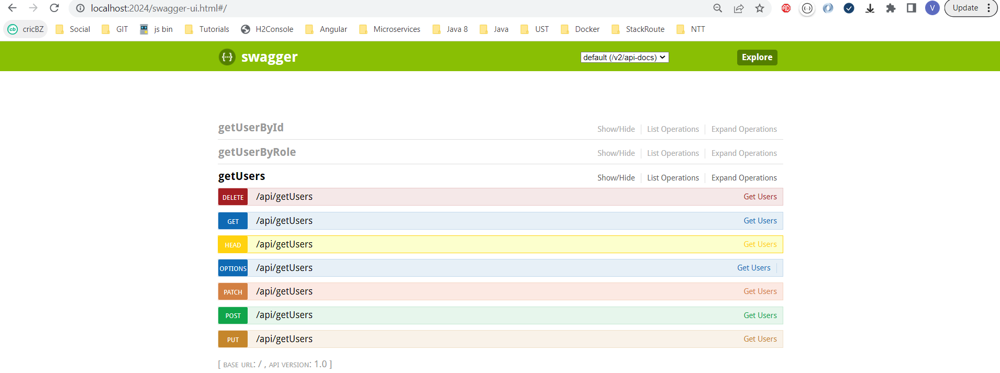
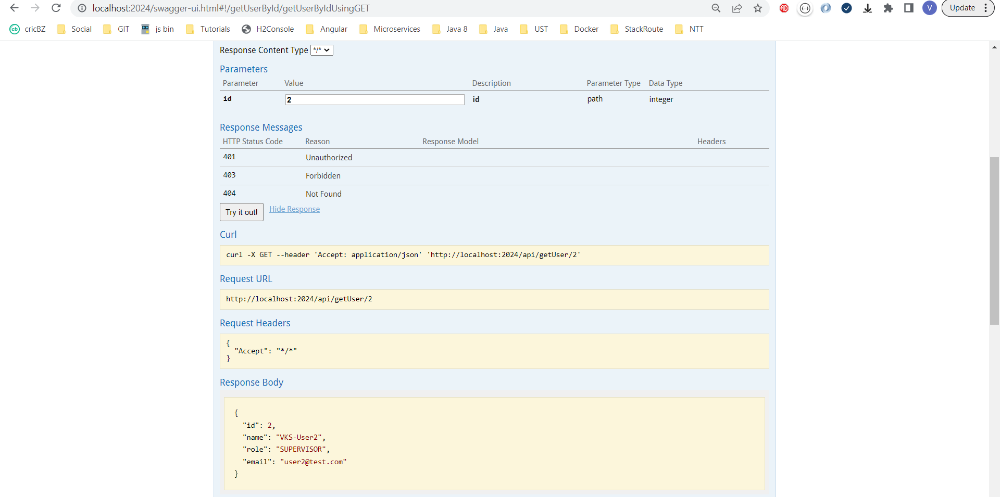

### Examples

# Spring Boot Swagger 2 Example | VKS

## URLS
http://localhost:2024/swagger-ui.html

http://localhost:2024/v2/api-docs/

## Run Spring Boot application
```
mvn spring-boot:run
```
## Test Spring Boot Swagger 2 Example
<ol>
<li>Wrest points and can execute to get the response.</li>
</ol>

## Snapshots

